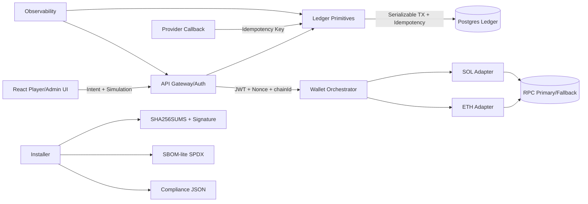

# zGaming Upgrade Architecture (2026)

## Notes
- Wallet orchestration remains stateless at API layer; signing key material is abstracted via provider interface.
- Ledger path is append-only with immutable transaction hash to support post-incident forensics.
- Installer pipeline emits auditable artifacts for regulator handover.
